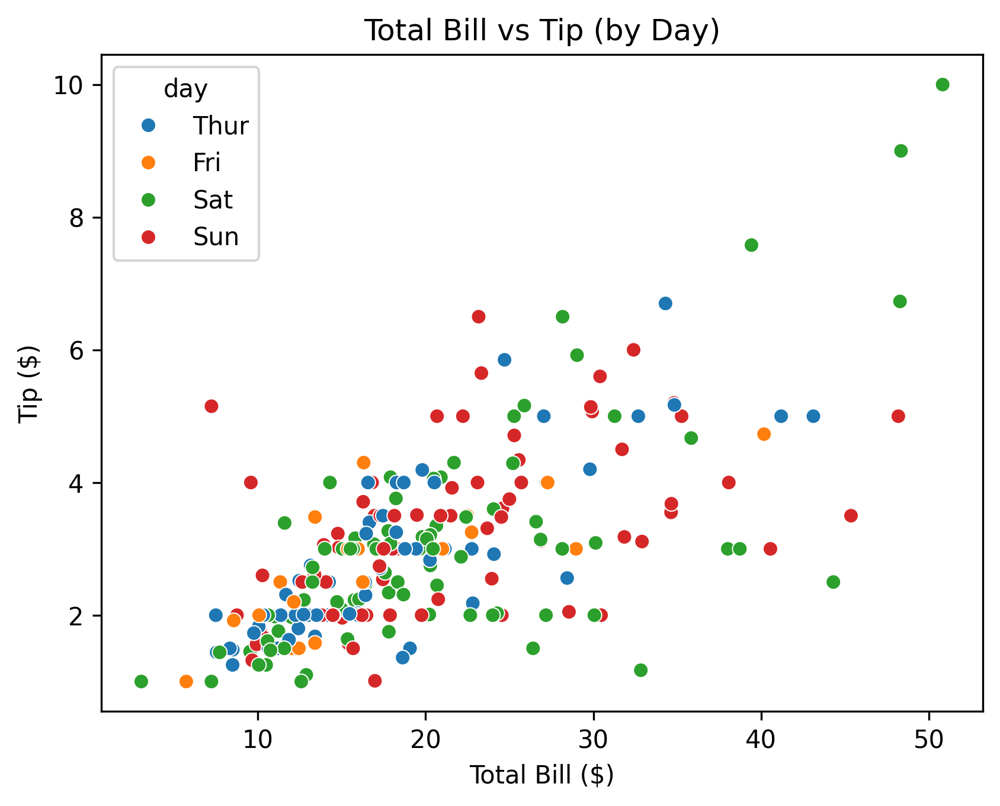
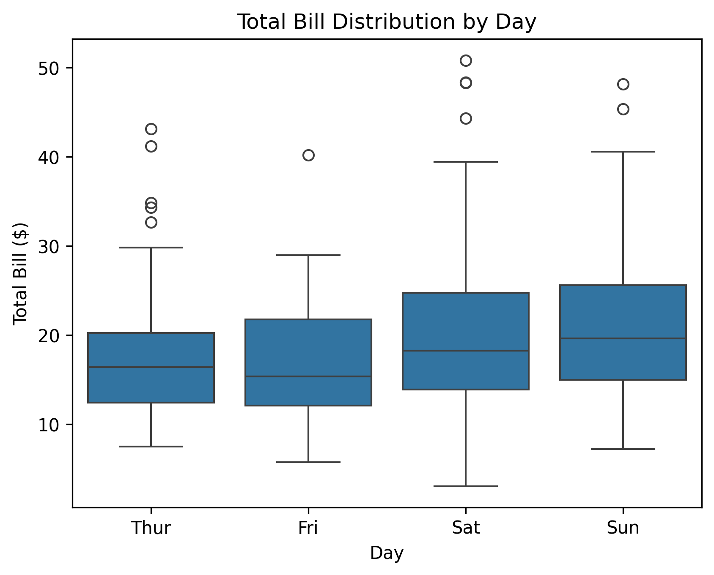

# Exploratory Data Analysis of Restaurant Tipping Data

> Professional Python for Data Analytics

This project comes with professional documentation.

Explore the tabs and sidebars for content.

This is where we present our analytics work.

See:

- [Resources](./RESOURCES.md)
- [Troubleshooting](./TROUBLESHOOTING.md)

---

## Custom Project

### Dataset
This project uses Seaborn’s built-in tips dataset, which includes restaurant billing data like total bill, tip amount, party size, and some context like day of the week, time of day, and customer info. It’s a nice mix of numeric and categorical data, so it works well for practicing basic EDA and feature engineering.

### Signals
I used both the original dataset columns and a couple of engineered features:

- Numeric columns: total_bill, tip, size
- Categorical columns: day, time, sex, smoker
- New features I created:
  - `spending_category` (Low, Medium, High based on total bill)
  - `bill_vs_day_avg` (compares each bill to the average bill for that day)

These added features helped give a little more context to spending behavior instead of just looking at raw numbers.

### Experiments
I did two main feature engineering steps:

- First, I binned total bill into a simple spending_category so it’s easier to see low vs high spenders at a glance.
- Then I created bill_vs_day_avg, which compares each transaction to the average bill for that specific day. This helps show whether a bill is above or below “normal” for that day.

### Results

A few clear patterns showed up in the data once the visualizations and derived features were added.

There is a clear positive relationship between total bill and tip amount, meaning larger bills generally result in higher tips. Party size also appears to play a smaller role, since larger groups tend to appear more often in the higher spending range.

Looking at spending by day, the distribution is fairly consistent across the week. While there are some small differences in spread and a few outliers, no single day stands out as dramatically higher or lower in spending.

The derived feature bill_vs_day_avg adds more context to this pattern by showing how each transaction compares to the average for that day. Most values cluster around 1, which makes sense since it represents “average-level” spending, with some clear higher and lower outliers.

### Interpretation
Overall, the main takeaway is that total bill size is the strongest driver of tip amount. Day of the week doesn’t really change behavior that much.

The derived features helped make the data a bit easier to interpret. Instead of just raw values, I can now see relative spending patterns and group customers into clearer segments.

From a business perspective, it looks like increasing order size is more closely tied to higher tips than anything else in the dataset.
